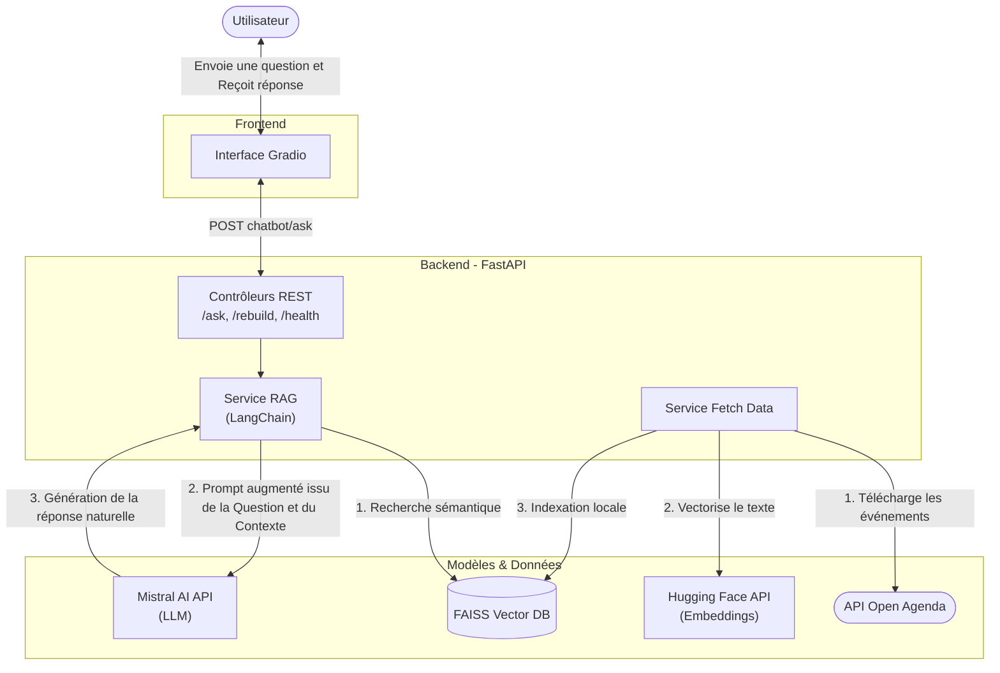

# POC Chatbot Intelligent - Puls-Events (Documentation Technique)

Ce projet vise à démontrer la faisabilité technique et la pertinence métier d'un chatbot intelligent capable de répondre aux questions des utilisateurs sur des événements culturels à venir. Le système utilise une approche de **Retrieval-Augmented Generation (RAG)** combinant recherche vectorielle et génération de réponses en langage naturel basées sur des données réelles.

---

## 1. Architecture du Système

Le diagramme UML ci-dessous illustre le flux de données et les interactions entre les différents composants de l'application :



---

## 2. Rôle des Composants

Le projet est modulaire et s'appuie sur la stack technique suivante :

- **Gradio (Frontend)** : Fournit une interface utilisateur interactive de type "chat" (bulle de messages) simple d'utilisation. Il encapsule l'appel à l'API Backend.
- **FastAPI (Backend Controllers)** : Serveur robuste exposant l'API REST. Il gère le cycle de vie de l'application (téléchargement des données au démarrage), expose le point d'entrée pour les questions (`/ask`), le rechargement forcé de la base (`/rebuild`) et les vérifications d'état (`/health`).
- **Open Agenda API (Fetch Data)** : Source de données externe fournissant les événements culturels (actuellement configurée pour la région de Paris). C'est la base de connaissance du chatbot.
- **Hugging Face (`sentence-transformers`)** : Fournisseur du modèle d'embedding multilingue (`paraphrase-multilingual-mpnet-base-v2`). Il convertit le nom et la description des événements en vecteurs mathématiques (plongements lexicaux).
- **FAISS (Vector Store)** : Base de données vectorielle locale. Elle indexe les embeddings d'événements et permet d'exécuter des recherches de similarité extrêmement rapides pour trouver les événements répondant à la question de l'utilisateur.
- **Mistral AI (`mistral-medium-latest`)** : Le grand modèle de langage (LLM) responsable de la synthèse. Via LangChain, il reçoit le prompt strict incluant la demande utilisateur et le contexte exact issu de FAISS pour rédiger une réponse conversationnelle et fiable sans hallucination.
- **Ragas (`evaluate_rag.py`)** : Script d'évaluation du RAG mesurant des critères qualitatifs clés (Faithfulness, Answer Relevancy, Context Precision, Context Recall) pour automatiser les tests qualitatifs.

---

## 3. Structure du projet

* `src/puls_events_chatbot/main.py` : Point d'entrée de l'application FastAPI, démarrage serveur et process Gradio.
* `src/puls_events_chatbot/controllers/` : Déclaration des routes API (endpoints HTTP).
* `src/puls_events_chatbot/services/chatbot.py` : Cœur de la logique RAG (connexion FAISS / Mistral / LangChain).
* `src/puls_events_chatbot/services/fetch_data.py` : Récupération asynchrone des événements depuis OpenAgenda.
* `src/puls_events_chatbot/gradio_interface.py` : Configuration de l'interface visuelle du chatbot.
* `tests/evaluate_rag.py` : Pipeline de tests des métriques via Ragas avec le dataset de validation `test_cases.json`.

---

## 4. Instructions de déploiement (Docker)

### Prérequis
Docker et Git doivent être installés.

### Actions à réaliser

1. Cloner le projet :
   ```bash
   git clone https://github.com/MarieSainte/puls-events-chatbot.git
   cd puls-events-chatbot
   ```

2. Configurer l'environnement :
   Créez un fichier `.env` à la racine contenant vos clés API :
   ```ini
   MISTRAL_API_KEY=votre_clé_Mistral
   HUGGING_API_KEY=votre_clé_Hugging_Face
   API_BASE=http://127.0.0.1:8010/chatbot
   ```

3. Lancer via Docker :
   Vous pouvez utiliser le script fourni ou les commandes natives :
   ```bash
   docker build -t puls_events_chatbot .
   docker run --name puls-chatbot -p 8010:8010 -p 7860:7860 --env-file .env -d puls_events_chatbot
   ```

4. Accès :
   - Frontend (Gradio) : `http://localhost:7860`
   - API Backend (Swagger) : `http://localhost:8010/swagger`

### Arrêt & Nettoyage
```bash
docker stop puls-chatbot
docker rm puls-chatbot
```

---

## 5. Utilisation en Local (sans Docker)

### Prérequis
Poetry doit être installé.

### Démarrage
```bash
poetry install
poetry run uvicorn src.puls_events_chatbot.main:app --host 0.0.0.0 --port 8010 --reload
```
L'interface Gradio démarre automatiquement en arrière-plan avec le backend.

---

## 6. Évaluation RAG (Ragas)

Le système intègre un script d'évaluation continue (`tests/evaluate_rag.py`) qui permet de mesurer la qualité des réponses de l'IA (LLM-as-a-judge) sur un jeu de données de référence (`test_cases.json`). Nous monitorons 4 métriques RAGAS :

**Génération (LLM) :**
- **Faithfulness** : Vérifie que la réponse générée est strictement fidèle au contexte récupéré, sans hallucination.
- **Answer Relevancy** : Mesure si la réponse est directement pertinente et utile par rapport à la question de l'utilisateur.

**Récupération (Vector Store / Embeddings) :**
- **Context Precision** : Évalue si le contexte récupéré (les événements) est pertinent et si les documents les plus utiles sont classés en premier (peu de bruit).
- **Context Recall** : Mesure si *toutes* les parties du contexte nécessaires pour répondre à la question ont bien été extraites de la base FAISS.

*Remarque : Ce processus est automatisable via les flux CI/CD (ex: le pipeline échoue si `context_precision` ou une autre métrique chute sous 0.8).*

### Résultats actuels (POC)

Exemple de retour sur notre dataset `test_cases.json` :
```text
--- RÉSULTATS DES MÉTRIQUES (RAGAS) ---
context_precision: 1.0000
context_recall: 1.0000
faithfulness: 1.0000
answer_relevancy: 0.9542
```
Ces excellents scores s'expliquent par le fait que FAISS trouve systématiquement le bon événement pour les questions ciblées du test, et que Mistral rédige ses réponses en restant strictement fidèle au contexte fourni sans halluciner.

---

## 7. Perspectives et Améliorations (Post-POC)

Ce projet étant un **Proof of Concept**, voici les axes d'améliorations majeurs pour un passage en production à grande échelle :

1. **Mise à jour en temps réel (ETL / CRON)** : Actuellement, le jeu de données OpenAgenda est téléchargé et vectorisé au lancement du serveur FastAPI. Une amélioration consisterait à externaliser cette tâche dans un batch récurrent (ex: Airflow/CRON) pour des mises à jour incrémentales.
2. **Scalabilité de la Base Vectorielle** : Bien que `FAISS` in-memory soit extrêmement rapide pour ce POC, le remplacer par une solution gérée comme **Qdrant**, **Pinecone** ou **Weaviate** permettrait de soulager la RAM du conteneur et de partager l'index entre plusieurs instances.
3. **Gestion de l'historique (Mémoire)** : Permettre au bot de garder le contexte de la discussion (*Conversational Retrieval Chain*) pour que l'utilisateur puisse rebondir sur un événement suggéré sans avoir à répéter son contexte.
4. **Stratégies de Chunking avancées** : Affiner le découpage textuel ou utiliser une recherche hybride (Vectorielle + Mots-clés / BM25) pour être plus robuste face aux fautes d'orthographe classiques.
5. **Mise en Cache (Redis)** : Sauvegarder les requêtes fréquentes pour renvoyer la réponse sans consommer de tokens sur l'API Mistral.